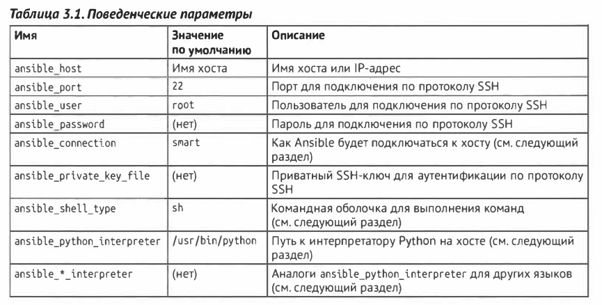
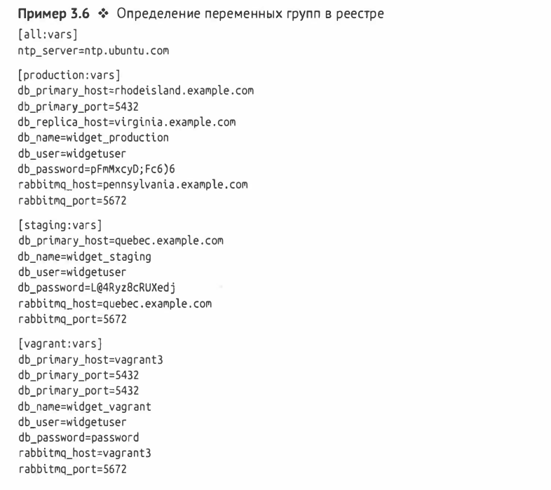

# Глава 3. Реестр: описание серверов (Inventory)

По умолчанию ansible добавляет автоматически хост localhost.

 

 
стр. 69 - описание всех параметров.

Также в файле инвентори можно так:

`[web]`
`web[l:20].exaмple.coм`

`[web]`
`wеЬ[01:20].ехамрlе.сом`

`[web]`
`web-[a-t].exaмple.coм`

### Переменные

 

 

### Динамический реестр 

page 77

### Добавление элементов во время выполнения с помощью ADD_HOST, GROUP_BY
page 83

